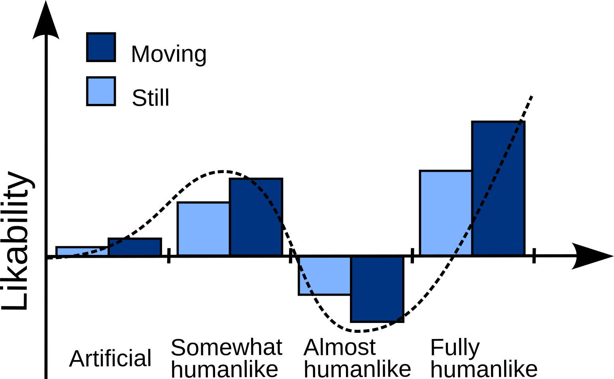

# Wyjaśnienia Doliny Niesamowitości

## Threat avoidance (unikanie zagrożenia)

MacDorman et al. (2009) mentioned one of the evolutionary explanations, in which the
uncanny valley appears in order to avoid threat from pathogens (threat avoidance). The
idea is derived from the disgust theory (Rozin and Fallon, 1987). The strangeness of the
individuals may indicate transmission of the disease (such as, for example, in the case of
leprosy). And the greater the genetic proximity of groups of individuals (similarity to humans), the greater the chance that potential pathogens will be harmful to both (see Moosa and Ud-Dean, 2010). Therefore, disgust and avoiding different individuals is beneficial as an
adaptation.

 macdorman2009.pdf - podpunkt 1.2.1.1.

## Mortality salience

Mortality salience (or terror management) explanation attributes the effect of the negative emotions to the elicitation of an innate fear of death. It refers to the human tendency to
avoid thinking about the inevitability of death (MacDorman and Ishiguro, 2006, annex A).
It is about suppressing conscious thoughts about death and weakening them by rationalization. Also, as a result of subconscious death indicators, anxiety is triggered. Characters like
androids can subconsciously trigger death thinking, because they are inanimate. And this,
in turn, can cause a negative affect that falls into the valley of eerie (MacDorman, 2005;
MacDorman et al., 2009).

## Evolutionary aesthetics

The evolutionary aesthetics hypothesis states that the attractiveness of characters is the
main variable controlling corresponding disgust. There is a relationship between having
beauty markers and favoring a person, which is supposed to translate into the selection
of more prolific and immunologically resistant individuals (Thornhill and Gangestad, 1999;
Conway et al., 2008). According to this explanation, the reluctance to characters from the
Mori’s valley is due to their unattractiveness, that is, the wrong texture of the skin, lack of
vitality, disorder of body symmetry or others. If the characters aesthetic is right, any level
of realism can be appealing (Hanson, 2006).

## Categorical ambiguity (niezgodność kategorialna)

According to this explanation, the eerie sensation is caused by difficulties in categorization
of characters which lies between robot and human category. Categorical perception concept,
which underlies this hypothesis, assumes that differences between exemplars may be perceived as more abrupt and qualitative contrary to continuous perception where differences
are seen as gradual and quantitative. The theory suggests that categorical perception can be
inborn or can be induced by learning (Harnad, 2003).

 katsyri2015.pdf - s. 5-6

## Perceptual mismatch (niedopasowanie percepcyjne)

Perceptual mismatch attributes eerie sensation to inconsistency in humanlikeness of
characters visual cues (e.g., artificial eyes on a humanlike face) or presence of atypical features in character (e.g., excessively enlarged eyes) (Pollick, 2009; K¨atsyri et al., 2015; Seyama
and Nagayama, 2007).

 katsyri2015.pdf - s. 7

## Uncanny valley of mind
Additionally, the uncanny valley of mind explanation has been proposed. It refers to the
Theory of Mind and mirror neurons development (e.g. Chaminade et al., 2007; Krach et al.,
2008). According to the hypothesis, characters close to human induce a network of mirror
neurons to predict the intentions of these characters. For less humanlike characters, such
as humanoid toys or robots, no mentalization occurs contrary to almost human characters.
Because people have very well developed facial recognition skills and precise facial expressions
detectors, even minor deviations from the norm are caught and can cause contradictions in
intentions and invoke the discomfort. Therefore, this inaccurate representation of mimic
behaviors and the image of robots and CGI characters (computer generated imagery) are
the hypothesized cause of negative emotions. An explication of this explanation has been
proposed by Gray and Wegner (2012), suggesting involvement of two dimensions of mind
perception – experience and agency.
